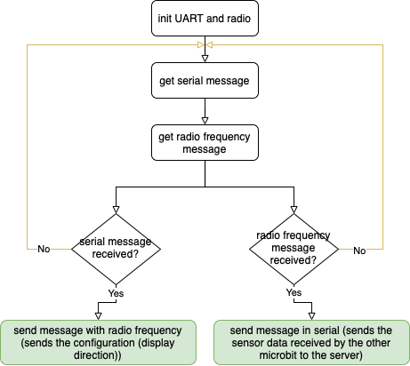

# Microbit serial (passerelle) - Equipe 16

# Introduction

Le code est fonctionnel et commenté. Il permet à un microcontrôleur de communiquer via radiofréquence grâce à un protocole de réseau et de communiquer via serial.

# Architecture

## Déroulement



## Conception

### Variables

```python
'''
 * variables for script
'''
radioProtocol = protocol.RadioProtocol(1)
```

- `radioProtocol = protocol.RadioProtocol(1)` → Initialisation du protocole réseau pour la communication entre les deux microcontrôleurs

*Note : protocol correspond au script python pour notre protocole réseau*

### Initialisation

```python
'''
 * init comm
'''
uart.init(115200)
radio.config(group = 2)
radio.on()
```

- `uart.init(115200)` → Initialisation de l'uart pour la communication avec le serveur en serial
- `radio.config(group=2) radio.on()` → Initialisation de la communication radiofréquence (pour faire communiquer les deux microcontrôleurs)

### Main

```python
'''
 * main programme
'''
while True:
	message = radioProtocol.receivePacket(radio.receive_bytes())  # data from another microbit by radio frequency through the network protocol
	msgUartStr = uart.read()                                      # data per serial port
	if msgUartStr:
	  radioProtocol.sendPacket(str(msgUartStr), 2)                # send configuration (TL or LT)
	if message:
	  print(message)                                              # send data by serial to the gateway
```

Le but de ce programme est :

1. De détecter des envoient de données 
    - Données reçues via **`serial`**
        
        ```python
        msgUartStr = uart.read()
        ```
        
        → corresponds aux données envoyées par le serveur, ces données sont des **`données de configuration (ordre d'affichage)`**
        
    - Données reçues via **`radiofréquence`**
        
        ```python
        message = radioProtocol.receivePacket(radio.receive_bytes())
        ```
        
        → corresponds aux données envoyées par le deuxième microcontrôleur, ces données sont des **`données issues de capteurs (température et luminosité)`**
        
2. Envoyer des données
    - Données de **`configuration`** (celles reçues par serial)
        
        ```python
        if msgUartStr:
        	radioProtocol.sendPacket(str(msgUartStr), 2)         
        ```
        
        → envoyé la configuration via radiofréquence grâce au protocole réseau au deuxième microcontrôleur pour lui indiquer **`l'ordre d'affichage`**
        
    - Données issues des **`capteurs`** (celles reçues par radiofréquence)
        
        ```python
        if message:
        	print(message)
        ```
        
        → envoyées la **`luminosité et la température`** via serial dans le serveur